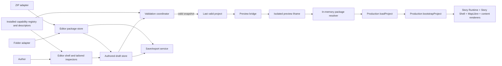

# GUI Editor V1 — Architectural Design

Status: proposed for review

Date: 2026-08-28

Authoritative base: `main` at `5d2636032830d9b2a2f9091cb02e56c39e28482e`

Authoritative post-merge CI: `33155216875` — PASS

Locked production authority: `docs/baseline-authoring-contract-v1.md`

Final template certification: `review/well-rounded-map-story-template-v1/REPORT.md`

## 1. Problem and goals

GUI Editor V1 lets a non-developer create and maintain ordinary planning and map-storytelling projects without editing JavaScript or HTML. It is a structured desktop authoring application at `/editor/`, deployed beside the current static application.

The editor writes the same production resources that the application already consumes:

- `project.json` conforming to `PROJECT_MANIFEST_V1`;
- Story JSON using Story Schema 1.0 or 1.1;
- GeoJSON line, point, and polygon resources;
- normalized table JSON;
- static metric JSON; and
- declared image assets.

There is one project model, one validation authority, one descriptor catalog, and one preview runtime. The editor must not introduce a GUI-only schema, translate an editor model into production data, duplicate Story semantics, or simulate production rendering.

V1 succeeds when all seven acceptance scenarios in section 25 can be completed and every exported project package is accepted directly by `loadProject(...)` when mounted into the unchanged production runtime. The export is authored project content, not a copy of the runtime or complete hosted site.

## 2. Explicit non-goals

V1 does not include:

- backend or cloud project storage, database persistence, accounts, authentication, a CMS, or multi-user collaboration;
- comments, review workflows, deployment management, or GitHub integration inside the editor;
- geometry drawing/editing, route snapping, GIS analysis, spatial joins, or QGIS replacement;
- arbitrary MapLibre expressions, raw layer IDs, shaders, 3D/BIM/Three.js authoring, or free-form page layout;
- a spreadsheet engine, formulas, pivots, joins, XLSX import, or runtime CSV support;
- arbitrary JavaScript, HTML blocks, callbacks, module URLs, remote plugins, a plugin marketplace, or visual capability construction;
- branching Story graphs, mobile authoring UI, or a general-purpose JSON Schema form builder; or
- automatic Story 1.0 migration or a migration wizard.

Complex geometry preparation remains an external GIS responsibility. Special behavior remains a trusted, developer-built capability installed in the application registry.

## 3. Locked authority and invariants

`BASELINE_AUTHORING_CONTRACT_V1` is locked by `docs/baseline-authoring-contract-v1.md` and certified by `review/well-rounded-map-story-template-v1/REPORT.md`. GUI Editor V1 must consume, not reinterpret, these authorities:

1. `PROJECT_MANIFEST_V1` and the production project loader;
2. `CORE_CONTENT_PACK_V1`, including all Story 1.0 blocks and the Story 1.1 table, chart, image, and legend blocks;
3. `COMMON_MAP_ACTIONS_V1`;
4. `DATA_METRIC_BINDING_V1`;
5. `CAPABILITY_EXTENSION_BOUNDARY_V1`; and
6. vendored Chart.js 4.5.1 through the production chart renderer.

The following invariants are architectural gates:

- Authored draft values are plain serializable production values. No class instance, function, DOM node, file handle, or editor metadata may enter saved JSON.
- Production validators and `loadProject(...)` remain authoritative. Editor navigation metadata may map a production error path to a control, but may not define a second validation rule.
- The trusted installed capability registry is the only source of optional capability implementations.
- The exported directory or ZIP is a normal authored project package that the unchanged production runtime can mount and load. It contains neither editor code nor a bundled copy of the runtime/site.
- Stable public IDs are used for references. Private MapLibre source and layer IDs never appear in author controls.

## 4. Primary user workflow

The shell supports this visible sequence:

```text
New/Open project
  → edit project metadata and map defaults
  → add datasets, tables, metrics, and images
  → define focus targets
  → add explicitly GUI-addable trusted capabilities or edit existing declarations
  → create and order Story states
  → create and order content blocks and map actions
  → preview with the production runtime
  → inspect and repair validation errors
  → save to the user's folder or export a production ZIP
```

The editor is non-modal for ordinary work. Selecting an item in the hierarchy changes the inspector while the preview remains mounted. Creation dialogs are limited to choosing an entity type, generating a stable ID, and collecting the minimum required fields.

## 5. UX information architecture

### 5.1 Desktop shell

The editor uses a structured four-region shell, not a free-form canvas:

- **Top bar:** New, Open Folder, Import ZIP, Save, Export Project ZIP, Validate, preview status, and a dirty-state indicator. Save is relabeled or disabled when the active storage adapter cannot write in place.
- **Left navigation:** Project, datasets, assets, metrics, focus targets, capabilities, Stories, and the ordered state list for the selected Story. Sections show item counts and error badges.
- **Center preview:** a persistent isolated preview with Story/Explore mode, desktop/mobile viewport presets, restart, current state, and validation status.
- **Right inspector:** tailored controls for the selected project entity, state, block, action, or capability.
- **Bottom validation drawer:** opens on demand or on failed validation and lists diagnostics by severity, code, path, and message.

Pane sizes are CSS layout concerns and do not justify a UI framework. The application remembers only harmless UI preferences such as pane width and last viewport preset; these preferences are never project authority.

### 5.2 Selection and ordering

Story states, content blocks, and action arrays are rendered as ordered lists. Their visible order is their JSON array order. Reordering writes the corresponding array immediately in the authored draft.

Every reorderable item has Move Up and Move Down controls. Drag reordering may be added as a convenience, but it is not the only mechanism. After a move, keyboard focus remains on the moved item and an `aria-live` message announces its new position.

### 5.3 IDs and references

New entity IDs are generated from the initial label, normalized to the locked lowercase ID vocabulary, and made unique with a numeric suffix. IDs remain stable when labels change. They are visible in an advanced/details row but are not routine editable labels.

V1 does not provide general reference-cascade refactoring. If explicit ID rename is offered, it is a deliberate command that first enumerates every known production reference, applies one atomic draft mutation, then revalidates. Otherwise the ID field is read-only after creation. Deleting a referenced entity is allowed only through a confirmation that identifies resulting broken references; the invalid draft remains repairable.

## 6. Compared technology approaches

| Approach | Implementation complexity | Maintainability and divergence | Static deployment and tooling | Testability and interaction growth | Decision |
| --- | --- | --- | --- | --- | --- |
| **1. Native ES modules and browser DOM in this repository** | Reuses the current module/test style, injected loader seams, DOM renderers, and static entry model. Requires small local stores and view helpers. | One language/runtime boundary and no framework lifecycle competing with MapLibre or Story Shell. Direct imports make production descriptor reuse obvious. | Deploys as static files. No new build system is required. A small ZIP or sortable dependency can be pinned/vendored later if justified. | Existing Node tests can cover pure stores and adapters; small browser tests cover interaction. More manual DOM discipline is needed as forms grow. | **Recommend for V1.** Repository evidence favors it: `package.json` has no runtime dependencies or build command, production is native ESM, and existing UI/renderers already use direct DOM APIs. |
| **2. React/Vite editor entry; production runtime unchanged** | Component state and form composition could help once inspector complexity becomes large, but V1 would first need a build pipeline, dependency policy, framework-to-production-module boundary, and MapLibre/iframe lifecycle integration. | React can organize a much larger editor, but creates two UI paradigms and raises upgrade/lockfile maintenance. It does not simplify the package, validation, storage, or preview problems. | Static output is possible, but source is no longer directly deployable and CI/build configuration expands. | Strong component testing options; interaction complexity may be easier after sustained growth. Current repository provides no evidence that this benefit exceeds setup cost for V1. | Defer. Reconsider only if implementation evidence shows inspector state or reuse is the dominant cost, not by framework preference. |
| **3. Separate editor application/repository** | Duplicates deployment, dependency, release, and cross-repository contract coordination. | Highest risk of descriptor/runtime version skew and preview drift. | Can deploy separately but violates the desired single static application shape. | Independent tests do not prove parity without additional integration infrastructure. | Reject absent an exceptional organizational or security boundary that does not exist here. |

The recommended choice is Approach 1. The editor should use small explicit render functions, event delegation, immutable snapshot boundaries, and replaceable inspector regions. This keeps V1 small without preventing a later framework migration behind the same package, validation, descriptor, and preview interfaces.

## 7. Editor architecture



There are three authorities with deliberately different lifetimes:

1. The **editor package store** owns package entries and storage provenance.
2. The **authored draft store** owns parseable production JSON values being edited.
3. The **validation coordinator** produces the **last valid package snapshot/project** that preview may consume.

The UI never mutates a loaded `ValidatedProject`; production loading deep-freezes that result. Instead, the UI edits a structured clone of authored resource values and asks validation to create a new validated snapshot.

## 8. Package and file model

`EditorPackage` is an in-memory representation of the real directory/ZIP, not a new on-disk format. Conceptually it contains:

```text
EditorPackage
  root project.json
  managed JSON entries referenced by project.json
  managed image entries referenced by project.json
  unknown safe ZIP pass-through entries (ZIP origins only)
  storage origin and per-entry dirty/write metadata (editor-only memory)
```

Each loaded entry has a normalized package-relative path, original bytes, current bytes or serializable JSON value, media kind, and managed/pass-through status. The file handle, ZIP object, dirty flags, parse diagnostics, and original-byte hashes are editor state around the entry; they are not serialized into project resources. Folder origins load only managed declared entries. ZIP origins may additionally hold safe pass-through entries because the selected ZIP is itself a bounded package.

### 8.1 Opening

**Folder Open does not recursively enumerate the selected folder.** It reads root `project.json`, applies the production path rules, then resolves and reads only declared Story, dataset, metric, and asset resources. Files not declared by the project remain unknown to the editor and untouched on disk.

**ZIP Import treats the selected ZIP as the bounded package.** It indexes safe normalized ZIP entries, reads `project.json` and its declared resources as managed entries, and retains other safe ZIP entries as opaque pass-through bytes. Unsafe, duplicate-normalized, absolute, traversal, or executable referenced paths are rejected or quarantined according to the existing production boundary.

An invalid manifest or broken reference does not reject the package. Parseable values enter the authored draft and production diagnostics place the editor in repair mode. A syntactically invalid known JSON file keeps its original text and a parse diagnostic; tailored controls for that file are unavailable until it parses, and a small source-repair view may edit that production file text directly. This escape hatch does not create a new schema and is not the ordinary authoring surface.

Unsafe package paths, duplicate normalized paths, absolute paths, path traversal, or executable project references are rejected or quarantined according to the existing production path boundary. ZIP extraction never writes entries outside the chosen target.

### 8.2 Preservation

Safe pass-through entries from a ZIP origin are copied byte-for-byte on subsequent ZIP export. Unknown folder files are never loaded, copied, rewritten, or deleted. Managed files that the user did not edit preserve their original bytes, including Story 1.0. Managed JSON is reserialized only after a user mutation to that file. Removed declared resources are not automatically deleted from a folder in V1; the declaration is removed and the file remains untouched unless the user explicitly chooses a separately confirmed delete operation. In a ZIP-backed package, a removed declaration leaves the original safe entry preserved as pass-through unless explicitly removed.

This conservative rule prevents the editor from erasing custom documentation, hosting files, or resources it does not understand.

## 9. File-system and ZIP strategy

### 9.1 Compared persistence approaches

| Strategy | Benefits | Limitations | V1 role |
| --- | --- | --- | --- |
| **A. File System Access API plus ZIP fallback** | Desktop Chromium can open a folder, retain handles for the session, and explicitly write changed authored files in place. ZIP covers browsers without directory-write access and gives a portable package. | Directory picking is limited-availability, requires a secure context and user activation, and permissions may need renewal. Multi-file writes are not transactionally atomic. | **Recommend.** Capability-detect at runtime; never assume support. |
| **B. ZIP-only** | Uniform browser behavior and naturally package-scoped import/export. | Every save creates a download; repeated edits are cumbersome; authors must replace/extract packages manually. | Required fallback, not primary desktop UX. |
| **C. Server/backend persistence** | Central storage and future collaboration are possible. | Adds authentication, security, hosting, migrations, operational cost, and a second authority. | Reject for V1. |

The File System Access API remains a draft/limited-availability web capability, so the UI presents both Open Folder and Import ZIP where appropriate rather than hiding the fallback. It requires HTTPS in deployment (localhost remains suitable for development) and a direct user gesture for the picker.

Platform references: [WICG File System Access specification](https://wicg.github.io/file-system-access/) and [MDN `showDirectoryPicker()` compatibility/security notes](https://developer.mozilla.org/en-US/docs/Web/API/Window/showDirectoryPicker).

### 9.2 Package adapter boundary

Storage adapters implement a small behavior contract:

- `open()` returns the root manifest and only its resolved declared entries for folder origins, or the bounded ZIP entry set for ZIP origins, plus storage capabilities;
- `read(path)` returns bytes;
- `writeChanges(changeSet)` writes only explicitly changed managed entries when supported;
- `export(entries)` creates a ZIP or folder selection; and
- `describeOrigin()` provides UI labels, never authored metadata.

The draft store has no knowledge of directory handles or ZIP libraries. Folder, ZIP, and new in-memory packages feed the same package store.

### 9.3 New, save, and export

- **New Project** creates a minimal valid production `project.json`, one Story 1.1 file with one initial state, empty registries, and no editor metadata. It is initially memory-backed.
- **Save** writes changed managed files back through the folder adapter. On unsupported browsers or ZIP origins, Save becomes “Export ZIP”. A new in-memory package may choose a folder on supported browsers or export ZIP.
- **Export Project ZIP** stages `project.json`, every declared authored Story/data/metric/asset resource, newly authored managed entries, and safe pass-through entries inherited from a ZIP origin. Folder-origin exports do not sweep in undeclared folder files. Export is disabled while fatal diagnostics remain.

Save and Export have different policies. Save protects ongoing author work and may persist an invalid draft after a clear confirmation; it never claims the package is production-valid. Export produces a production-valid authored project package and is blocked by fatal validation errors. It does not produce a standalone deployable site. Warnings do not block either operation.

Certification mounts the exported project package at a package root served by the unchanged production runtime, then invokes normal production startup. Standalone runtime/site bundling is explicitly deferred.

Before folder Save, serialization of every changed entry completes in memory. Writes then occur in a deterministic order with `project.json` last, reducing the chance that the manifest points at resources not yet written. If a write fails, the editor reports exactly which files succeeded or failed, retains dirty state for unwritten entries, and does not pretend the operation was atomic. V1 does not add shadow files or hidden metadata to the user's package.

IndexedDB is not authored-project authority. It may store tiny UI preferences, but not the current package or an implicit autosave.

## 10. Editor state model

### 10.1 Authored draft

The authored draft contains only mutable, plain production data keyed by package-relative file:

- manifest value;
- Story values;
- GeoJSON values;
- normalized table values;
- metric value; and
- asset bytes/metadata already represented by the manifest.

Draft mutations are explicit commands such as replace dataset, update field, insert state, or move block. Commands simplify dirty tracking and optional undo later, but the saved result is always the plain data snapshot. Temporary invalidity is expected.

### 10.2 Last valid project

The last valid record contains:

- the package revision that passed production loading;
- an immutable serializable package snapshot; and
- the resulting production `ValidatedProject` or success metadata needed by the editor.

It changes only after the current revision passes the full production loader. It is never edited. Preview uses the matching valid package snapshot, not a transformed view model.

### 10.3 Editor UI state

UI state includes selection, expanded sections, active Story/state/block, validation drawer state, preview mode/viewport, preview camera telemetry, package origin, dirty entries, and the current validation run token. It is neither nested under the manifest nor included in Story JSON.

The dirty indicator compares current managed entry bytes against their last saved/imported bytes. Preview validity and disk cleanliness are separate: a draft may be valid but dirty, or invalid but fully saved.

## 11. Validation architecture

The validation coordinator reuses production validation functions and the production loader. It does not encode field constraints itself.

```mermaid
sequenceDiagram
    participant D as Draft store
    participant V as Validation coordinator
    participant P as In-memory package resolver
    participant L as Production loader/validators
    participant R as Preview bridge
    D->>V: revision changed
    V->>V: debounce and cancel stale run
    V->>P: serializable package snapshot
    V->>L: loadProject(virtual manifest URL, fetchImpl, trusted registry)
    alt valid
        L-->>V: ValidatedProject
        V->>R: revision + valid package snapshot
    else invalid
        L-->>V: ProjectLoadError / StoryValidationError
        V-->>D: diagnostics; keep previous last-valid record
    end
```

Validation has two layers, both backed by existing production code:

1. A diagnostic pass invokes the production manifest, resource, Story, capability, and reference validators at their natural boundaries and catches their existing `{code, path, message}` errors. Independent resources may be checked in one run so the drawer can show more than one repairable issue. This orchestration adds no rules.
2. A definitive `loadProject(...)` pass is the acceptance gate and catches ordering/cross-resource behavior that isolated validation cannot prove. Only this pass promotes a revision to last-valid.

Where a legacy `StoryValidationError` does not expose structured fields, the coordinator reports the production message with `STORY_INVALID` and the nearest known Story path. Improving production error structure is preferable to parsing human-readable text; V1 must not maintain regex-derived validation semantics.

Diagnostics are tagged with package path and draft revision. A later edit cancels or invalidates an older run, preventing stale results. The drawer groups duplicates and sorts by file/path. Selecting a diagnostic uses a path-to-selection index to open the owning entity and focus the closest control, for example `$.datasets.stops.render.label.field`. This index is navigation metadata only.

The editor opens invalid packages and supports repair. Fatal errors pause promotion and block Export. Warnings such as optional unavailable resources remain visible but do not block. If no valid revision has existed, preview shows a neutral paused screen instead of attempting partial bootstrap.

## 12. Live preview architecture

Preview runs in an iframe and uses actual production modules:

```text
Editor draft revision
  → debounced production validation
  → structured-cloned last-valid package snapshot
  → postMessage envelope to preview iframe
  → preview package resolver
       ├─ fetch-compatible JSON/GeoJSON/table/metric responses
       └─ temporary object URLs for image assets
  → loadProject(..., { fetchImpl, capabilityRegistry })
  → bootstrapProject(...)
  → real Generic Story Runtime, Story Shell, MapLibre, content renderers,
    and vendored Chart.js 4.5.1
```

The iframe bootstrap is an editor entry adapter, not a preview renderer. Repository inspection shows that the complete production composition currently lives in `app.js`: it supplies the trusted registry, real map creation, Story Shell binding, Route 61-2 capability contexts, MapLibre, and Chart.js to `startApplication(...)`. Preview must not reconstruct those options.

The preview iframe therefore loads the actual production page/shell with an explicit editor-preview startup query. In that opt-in mode, the existing production composition waits for the parent handshake and starts `startApplication(...)` with the in-memory package transport. Normal production startup remains the default. A small extracted production-start function may make the two startup paths testable, but both paths call the same composition code and use the same production DOM, map creation, capability contexts, Story Shell binding, and runtime modules. There is no second preview HTML shell or editor-owned MapLibre setup.

### 12.1 In-memory transport seam

The loader already accepts `fetchImpl`, which covers JSON resources. Browser-managed image loads do not call that injected function, so the preview package resolver also materializes declared image bytes as temporary `blob:` URLs. The production loader needs one narrow transport hook that maps an already validated package-relative resource URL to its preview-resolvable URL when constructing resource records. Normal production uses the identity resolver; preview uses the object-URL resolver. This is URL transport, not authored-data translation: manifest/Story/resource values, reference validation, and renderers remain unchanged.

Object URLs are scoped to one preview revision and revoked on restart or replacement. Unknown files are not materialized. The resolver refuses paths outside the snapshot and never treats an authored script/module as executable.

### 12.2 Message protocol and lifecycle

Messages use a small versioned envelope with `type`, package revision, request ID, and structured-cloneable payload. The parent checks `event.source`; both sides validate message type and revision. The iframe sends ready, loaded, runtime-error, current-story-state, and camera-view messages. Commands call the real production experience's Story/Explore/restart surfaces; they do not dispatch synthetic Story actions. Camera telemetry supports “capture current view” but never becomes project data until the user invokes that command.

Only the newest valid revision starts. A new start aborts the previous load, destroys the prior bootstrap result, revokes object URLs, clears iframe-owned listeners, and creates one new MapLibre instance. Ordinary inspector selection does not restart preview.

### 12.3 Invalid-draft behavior

Draft edits are debounced. When a revision is valid, preview receives and starts that revision. When invalid, the iframe remains on the last-known-valid revision and the editor overlays “Preview paused — N validation errors.” It does not send invalid data, destroy the working preview, or reinitialize on every keystroke.

If the very first opened revision is invalid, preview remains paused until a valid snapshot exists. Manual Restart restarts the last valid revision; it does not bypass validation.

### 12.4 Preview UX

- **Story mode** enters the real Story Shell and follows the authored state array.
- **Explore mode** invokes the normal Story-to-Explore lifecycle.
- **Desktop/mobile presets** resize the iframe viewport; they do not change Story semantics. Desktop is the authoring default, and mobile preview is required.
- **Refresh/Restart** fully tears down and bootstraps the last valid revision.
- **Status** distinguishes validating, current, paused on invalid draft, runtime error, and stale preview.

### 12.5 Isolation and safety

The iframe is sandboxed to the minimum permissions compatible with the static module deployment and current map stack. It must not receive form submission, popup, download, top-navigation, camera, microphone, or arbitrary-origin privileges. If same-origin permission is required for native ESM/static assets, that limitation is documented and paired with a strict message allowlist; authored content still contains no executable code and production renderers use safe DOM construction.

The preview never receives directory handles. It receives only a cloned package snapshot. Runtime errors are serialized to safe `{code, path, message}` diagnostics; error objects and stack traces remain developer diagnostics and are not rendered as HTML.

## 13. Schema- and descriptor-driven form strategy

V1 uses a hybrid strategy.

### 13.1 Tailored editors

Project metadata/map, dataset presentation, table data, assets, metrics, focus targets, Stories/states, and content blocks receive purpose-built forms. These concepts need domain layout, cross-resource selectors, previews, and clear copy that a generic schema walker cannot supply.

Tailored does not mean duplicated schema. Controls read allowed values and bounds from exported production schemas/descriptors where practical, then submit plain values. Production validators decide correctness.

### 13.2 Bounded generic field/control factory

Action parameters, capability settings, and role bindings use one bounded recursive control factory for the schema subset already present in locked descriptors:

- object with `properties`, `required`, and `additionalProperties: false`;
- string with `const`, `enum`, `pattern`, and labels/help from the descriptor;
- finite number/integer with `minimum`/`maximum`;
- boolean; and
- simple arrays only when a locked descriptor actually uses them.

Unsupported schema features produce an explicit “not authorable in GUI V1” diagnostic for that trusted descriptor; they never fall back to silently accepting raw values. The field factory is not another validator and does not attempt the full JSON Schema specification.

Selectors are populated from live catalogs: dataset IDs, focus target IDs, metric IDs, capability target IDs, roles, or other named production resources. The factory recognizes trusted serializable presentation hints such as `gui.control` and `gui.optionsFrom` on a descriptor/property; `optionsFrom` names a catalog, never executable lookup code. An enum remains a selector without a hint. Baseline action target fields receive the matching public project/capability target catalog from the descriptor catalog adapter. If a capability-defined reference cannot be identified from enum or trusted catalog metadata, the editor reports that the field is not safely authorable rather than asking for a private MapLibre ID or guessing.

These hints affect control choice only. The production parameter schema still determines accepted values, and `loadProject(...)` still decides validity. Adding new hint vocabulary is a trusted additive descriptor revision, not an authored project schema or validation rule.

## 14. Project editor

The Project inspector edits:

- stable ID, title, subtitle, description, locale;
- organization, author, project date, and project version;
- preserved read-only basemap ID, editable initial center/zoom/pitch/bearing, and optional min/max zoom;
- Story collection and primary Story selection; and
- attribution/provenance entries and their references.

Ordinary authors set the initial camera with “Use current preview view,” which copies center, zoom, pitch, and bearing telemetry into the draft after confirmation. Numeric controls remain available for precision. Basemap selection is outside GUI Editor V1: existing project basemap IDs are displayed and preserved read-only, and New Project writes the currently supported production basemap ID, `openfreemap-dark`. The editor defines no basemap catalog and never asks users for a style URL.

## 15. Dataset, table, asset, and metric editors

### 15.1 GeoJSON datasets

Authors can add, import, replace, rename the label, set required/attribution metadata, bind an allowed capability role, and choose a bounded renderer. V1 supports line, point, and polygon geometry families; mixed data may open if production accepts it, but the editor does not create or reshape geometry.

The inspector exposes only contract fields:

- line: color, width, opacity, solid/dashed;
- point: color, radius, stroke color/width;
- fill: color, opacity, outline color/width; and
- optional feature label: property field, minimum zoom, placement.

The feature-label field is selected from observed top-level feature properties. Import validates `FeatureCollection`, declared geometry compatibility, and renderer compatibility using production validators. Import never modifies coordinates.

The manifest has no generic default-visibility field in the locked baseline, so the editor does not invent one. Authors express visibility changes with the certified `map.set-visibility` Story action; any future manifest visibility metadata requires an explicit contract addition.

### 15.2 Normalized tables

The table inspector shows declared columns, types, units, and a bounded grid. It may edit scalar/null cells and add/remove simple rows. Column IDs stay stable; adding or deleting columns is permitted only with explicit reference impact. There are no formulas, joins, sorting semantics, pivots, or spreadsheet calculation model.

Imported JSON must already use normalized table JSON. CSV is deferred to a future import adapter that outputs this same format; it is not a runtime contract addition.

### 15.3 Assets

The Assets section adds, replaces, removes, and previews declared images. It records only manifest fields: ID, package-relative source, media type, required flag, and attribution references. Alt, caption, title, decorative status, and Story source belong to each image content block because those semantics vary by use.

Removing or replacing an asset reports all image and legend references. SVG remains subject to the existing production safety boundary; the editor does not execute embedded script or grant it capability privileges.

### 15.4 Metrics

Static metrics can be created individually or imported/replaced from locked static metric JSON. They edit the locked metric-file vocabulary: label, literal scalar/null value, formatter, and attribution. Formatter controls cover integer, decimal, percentage, distance, currency, and text, including only the certified decimal/currency/unit fields.

Capability-computed metric descriptors come from the composed trusted capability catalog. Their IDs, labels, value types, and declared formatters are visible, read-only, and selectable by Story blocks, but they are never written into the static metric file. GUI V1 adds no metric-value preview telemetry solely for the inspector; computed runtime values remain visible through the actual Story preview where referenced by content.

## 16. Focus and map-action editors

### 16.1 Focus targets

The Focus section creates and edits the three production forms:

- datasets: one or more declared dataset IDs plus camera hints;
- coordinate: center and zoom plus camera hints; and
- bounds: southwest/northeast coordinates plus camera hints.

“Capture current preview view” offers:

- **Coordinate target:** current center and zoom, with pitch/bearing hints;
- **Bounds target:** current visible bounds, with optional maximum zoom/padding; or
- **Update initial camera:** current center/zoom/pitch/bearing.

The command shows the captured values before applying them. Raw camera JSON is never required.

### 16.2 Map actions

For Story 1.1, each state exposes ordered Enter and Exit action lists. Add Action first shows types from the composed production canonical action descriptor catalog. Selecting a type renders parameter controls from that exact descriptor and stores the resulting canonical action object directly in the Story array.

Baseline types are `map.focus`, `map.set-visibility`, `map.set-emphasis`, and `map.clear-emphasis`. Target selectors combine valid project dataset/focus IDs and selected capability-defined target IDs according to action semantics. Private MapLibre IDs are neither displayed nor accepted.

Move, duplicate, and delete operate on the underlying Story 1.1 action array. Preview executes the same order through the production Story Runtime.

For Story 1.0, existing legacy actions are displayed in their authored order and preserved, but their parameter controls are read-only in GUI V1. The trusted normalizers can validate/normalize legacy actions for runtime compatibility, but the serializable catalog does not expose their legacy parameter schemas. The editor does not infer those schemas, reuse canonical controls for a different legacy shape, or invent a second legacy descriptor vocabulary.

## 17. Story editor and content blocks

### 17.1 Story lifecycle

New Stories use `schemaVersion: "1.1"` and receive a stable ID, title, and at least one valid initial state. They receive full canonical action authoring from the production descriptors. Authors can add, duplicate, delete, and reorder states. Duplicating generates a new stable state ID and deep-clones its production content/actions. The state list position is the Story array position.

State metadata includes stable ID, the four locked layouts, presenter note where supported, and content blocks. Story 1.1 additionally has fully authorable ordered enter/exit action arrays; Story 1.0 legacy action parameters remain read-only as defined below. The editor does not introduce transitions or a branching graph.

### 17.2 Tailored content editors

The Add Block catalog comes from the composed production content descriptors and is filtered by Story version. Each block writes the descriptor's production shape directly:

- eyebrow, heading, paragraph, and disclosure: semantic text controls;
- stat-group: ordered items, metric selector, formatter, and tone;
- callout: ordered label/text/tone items;
- table: normalized dataset, selected columns, headers, alignment, format, title/caption/source;
- chart: bar/line/area, approved stacking, normalized dataset, X column, numeric series, labels/colors/format, title, description, and source;
- image: declared asset, alt/decorative invariant, title, caption, and source; and
- legend: ordered swatch/line/icon items with bounded colors or declared image assets.

The chart editor never exposes Chart.js configuration. The actual preview uses the production chart renderer and vendored Chart.js 4.5.1.

## 18. Capability editor

The Capability section reads `INSTALLED_CAPABILITY_REGISTRY.catalog()` and distinguishes implicit core packs, capabilities already declared by the opened project, and optional packs explicitly addable to ordinary projects.

Installed does not mean universally addable. Existing project declarations remain inspectable and editable when their trusted descriptors are installed, regardless of addability metadata. For a new declaration, the editor offers a capability only when trusted serializable descriptor GUI metadata explicitly sets `gui.addable: true`. Absent metadata defaults to existing-project-only. The editor owns no capability allowlist and does not infer addability from registry presence, label, group, dependencies, actions, or settings shape.

Consequently, the currently installed Route 61-2-specific `route-comparison-v1` and `urban-context-v1` packs do not appear as generic New Project choices merely because they are installed. Their existing declarations in Route 61-2 remain inspectable/editable. A developer may make a future ordinary-project capability addable by explicitly certifying it in trusted descriptor GUI metadata.

For an already-declared capability or an explicitly GUI-addable trusted capability, V1 may:

- show label, group, description, dependencies, roles, actions, targets, metrics, and help metadata;
- add its declaration when explicitly GUI-addable, or inspect/edit/remove an existing declaration;
- render data-only settings from `settingsSchema`;
- bind required/optional dataset roles by assigning the production `dataset.role` value;
- explain missing/incompatible role bindings; and
- expose its actions, targets, and computed metrics elsewhere automatically.

Adding an eligible pack also resolves declared dependencies or explains why it cannot be added. Removing an existing declaration shows affected action/metric/role references before mutating the draft. A dependency is not auto-added unless its own trusted descriptor is explicitly GUI-addable or it is already declared/implicit; otherwise the editor explains that developer preparation is required.

The editor cannot install a capability, load a URL/module, edit implementation code, create callbacks, or visually construct special behavior. A descriptor unsupported by the bounded field factory remains installed for runtime use but its unsupported settings are not editable in V1; this is an application/developer compatibility issue, not permission to expose raw executable configuration.

## 19. Story 1.0 compatibility policy

The policy is exact:

1. New Stories are always 1.1.
2. Story 1.0 files open, validate, and preview through the existing production 1.0 validators and trusted normalizers.
3. Supported Story 1.0 state metadata and the six Story 1.0 content block types may be edited. Story 1.1-only blocks cannot be added to a 1.0 Story.
4. Existing legacy map actions are displayed in authored order and preserved, but their parameters are read-only. The serializable catalog does not expose legacy parameter schemas, so GUI V1 neither invents a legacy descriptor vocabulary nor pretends canonical action controls describe legacy shapes.
5. Opening, validating, or previewing never rewrites Story 1.0 bytes.
6. Saving unrelated files does not serialize an untouched Story 1.0 file.
7. If the user explicitly edits supported Story 1.0 state/content metadata, Save writes the file as Story 1.0 and preserves its legacy action objects. It is not silently promoted to 1.1.
8. No migration wizard is included. A future explicit migration command requires a separate design and contract.

Therefore Route 61-2 opens and previews unchanged. Its Story file remains byte-identical unless the author explicitly edits supported content/state metadata and saves it; even then its schema version remains 1.0 and its existing legacy action parameters remain unchanged.

## 20. Error handling

Errors are classified without hiding the underlying production code/path/message:

- **Package errors:** unreadable ZIP, duplicate/unsafe path, missing `project.json`, permission denial, or write failure.
- **Parse errors:** invalid JSON or unsupported binary/media input.
- **Production validation errors:** manifest, resource, capability, Story, and reference diagnostics.
- **Preview runtime errors:** bootstrap, map/style/network, renderer, or capability lifecycle failures after a valid load.
- **Warnings:** optional missing resources, unavailable computed metrics, or non-blocking environment limitations.

The top bar shows a concise status; details live in the validation drawer. Controls use visible text/iconography in addition to color. A diagnostic activation selects its file/entity and focuses the nearest editable field. If a field cannot be represented, the source-repair view opens at the production path where possible.

Permission denial never loses the draft: the user can retry folder permission or export ZIP. Preview runtime failure does not invalidate authored data; it reports separately and offers Restart. Save/export write failures preserve dirty state and present a per-file result.

## 21. Accessibility

V1 targets keyboard-complete authoring:

- landmarks and headings describe top, navigation, preview, inspector, and diagnostics regions;
- every input has a persistent label, help/error association, and meaningful required state;
- hierarchy controls use native buttons and lists with predictable focus order;
- state/block/action reorder provides Move Up/Down controls, position text, and announcements; drag is optional;
- dialogs trap and restore focus; adding an entity focuses its first required field; deleting returns focus to a logical neighbor;
- validation is conveyed by icon, text, code/path, and programmatic descriptions rather than color alone;
- mobile preview controls have accessible names, and the iframe has a descriptive title; and
- reduced-motion preference is forwarded to the actual production preview.

The editor itself is desktop-first, but browser zoom and narrow inspector widths must remain operable. Full mobile authoring is not an acceptance requirement.

## 22. Security

Local package content is untrusted authored input.

- User strings render with `textContent`, native value properties, or production safe renderers; never `innerHTML`.
- No project value is evaluated, imported, or used as a script/module/plugin URL.
- Existing package-relative, same-package, no-traversal, no-JavaScript resource path checks remain authoritative.
- ZIP entry paths are normalized before use and cannot escape the package root.
- The trusted application registry controls capabilities and the basemap implementation. Capability declarations follow trusted `gui.addable` metadata, and the authored basemap ID is preserved read-only in V1.
- The preview receives no local file handles and has no direct write path.
- `postMessage` payloads are typed, revisioned, size-bounded, and accepted only from the known iframe window; the iframe accepts only its parent.
- Temporary image URLs are created only for declared supported image media and revoked promptly.
- SVG follows the existing production image boundary and is never promoted to executable DOM or capability code.
- Export never includes editor preferences, handles, object URLs, diagnostics, or preview state.

The editor may warn on unusually large packages before cloning or previewing them. It must not fetch arbitrary network resources from package declarations.

## 23. Static deployment and performance expectations

`/editor/` is a static entry in the same repository and hosting origin. It imports shared production modules by relative path. The production root entry and package contract remain unchanged. There is no server API, service worker, runtime database, or framework build requirement.

The File System Access path requires a secure context in hosted use. ZIP remains available wherever standard file input/download APIs and required JavaScript primitives exist.

Performance targets are proportional rather than benchmark-heavy:

- form input updates local draft state immediately;
- validation is debounced and stale runs are cancelled/ignored;
- only a valid changed package revision restarts preview;
- inspector changes do not remount the editor shell or preview iframe;
- large byte entries are reused between snapshots when unchanged; transferable buffers may be used where ownership permits;
- object URLs are revision-scoped and revoked; and
- one preview bootstrap owns one MapLibre instance at a time.

V1 does not performance-test ordinary form editing. A practical warning threshold and package-size ceiling are implementation decisions informed by browser testing, not new production schema limits.

Dependency posture remains integration-first. A single small mature ZIP library is justified if browser-compatible ZIP read/write would otherwise dominate custom code; its exact version is locked during implementation planning. Native Move Up/Down controls are sufficient for accessible ordering, so a sortable library is optional and must earn its cost. Split panes, tabs, forms, and CSS layout use the platform rather than a large UI framework.

## 24. Proportionate module boundaries

The proposal favors responsibility clusters rather than one file per noun:

| Cluster | Responsibility |
| --- | --- |
| `editor/editor.js` and shell styles/markup | Composition root, top-level commands, region layout, selection routing, and lifecycle. |
| `editor/core/package-store.js` | Declared folder resources or bounded ZIP entries, ZIP-only pass-through classification, byte preservation, path normalization, and dirty change sets. |
| `editor/core/draft-store.js` | Plain production draft snapshots and explicit mutations for project, resource, and Story values. |
| `editor/core/validation.js` | Debounce/cancellation, production-validator orchestration, definitive `loadProject`, diagnostics, last-valid promotion, path navigation index. |
| `editor/core/descriptors.js` | Read-only adapter over installed/composed catalogs plus the bounded field/control factory. It does not validate. |
| `editor/storage/adapters.js` | Folder and in-memory adapter contracts; ZIP implementation may be split only if the selected library boundary warrants it. Export staging belongs here rather than a second package model. |
| `editor/preview/bridge.js` and `package-resolver.js` | Parent protocol plus the iframe-side in-memory fetch/object-URL transport. The iframe is the actual production page in editor-preview startup mode; there is no duplicate shell, map setup, or renderer. |
| `editor/ui/inspectors.js` | Project, dataset/table, asset, metric, focus, and capability tailored inspectors, split later only when size demonstrates a need. |
| `editor/ui/story-editor.js` | Story/state ordered-list experience and Story-version policy. |
| `editor/ui/content-actions.js` | Tailored content blocks plus descriptor-driven action controls and array ordering. |

This is approximately ten focused modules plus static markup/styles, not a repository-wide refactor. Existing production modules change only for two narrow seams: an editor-preview startup handshake that calls the same production composition, and a resource-URL transport hook if implementation confirms it is required for in-memory image preview. Neither changes authored contracts or normal runtime behavior.

## 25. Acceptance criteria and success scenarios

### 25.1 Cross-cutting acceptance criteria

- The only saved schemas are the locked production schemas.
- Production descriptors populate content/action/capability choices.
- `loadProject(...)` is the definitive validation gate.
- Preview runs the actual production loader, bootstrap, Story Runtime, Story Shell, MapLibre, content renderers, and Chart.js 4.5.1.
- Draft invalidity never mutates or replaces the last valid preview.
- Folder save leaves unknown folder files untouched; ZIP re-export preserves unknown safe ZIP entries byte-for-byte.
- Fatal validation errors block production Export, while repair work can still be saved with a warning.
- Exported project packages mount into and run through the unchanged production runtime without editor code. Bundling a standalone deployable site is deferred.
- No arbitrary code or private MapLibre IDs can enter authored resources.

### 25.2 Scenario acceptance

1. **New project:** New creates Story 1.1; the author imports a route GeoJSON, styles/labels it, adds states, previews, exports, and the unchanged production runtime opens the mounted project ZIP contents without transformation.
2. **Data and evidence:** The author adds normalized table JSON and a static metric, creates table/chart blocks from discovered columns/metrics, previews, and exports.
3. **Map Story:** The author captures/creates focus targets, adds focus/visibility/emphasis actions, reorders states, and preview follows that exact array sequence.
4. **Image evidence:** The author adds an image, creates an image block with alt/caption/source, and the actual content renderer displays it through the preview transport seam.
5. **Optional capability:** The author either adds a trusted capability whose descriptor explicitly sets `gui.addable: true`, or edits an already-declared compatible capability. They bind required compatible dataset roles, edit supported data settings, select its discovered action, and preview without JavaScript. Installed packs lacking addability metadata are not offered as generic New Project choices.
6. **Existing project:** Route 61-2 opens as Story 1.0, validates and previews through production, and its Story bytes are unchanged until that Story is explicitly edited and saved.
7. **Invalid project:** A package with a broken reference opens in repair mode, the production diagnostic navigates to the field, preview retains the last valid revision or remains paused, Save warns, and Export is blocked until repaired.

## 26. Testing strategy

Future implementation uses a small evidence-focused suite:

- unit tests for declared-resource folder opening without recursive enumeration, safe ZIP pass-through/path normalization, dirty change sets, draft ordering/IDs, storage adapter parity, validation revision cancellation, and last-valid promotion;
- contract tests proving editor catalogs and generated action/settings values come from the same production descriptors used by capability composition and validation, including `gui.addable: true` and absent-metadata behavior;
- focused production-loader tests for the preview fetch/object-URL transport seam, including image revocation and path rejection;
- small preview integration tests for valid refresh, invalid-draft pause, one-map teardown/restart, Story/Explore, and mobile viewport;
- one browser authoring flow in each meaningful implementation PR; and
- a final smoke that exports a project package, mounts it into the unchanged production runtime, and loads it through normal production startup without editor code.

Route 61-2 gets a byte-preservation regression for open/preview/unrelated save. There is no massive browser matrix or ordinary-form performance suite.

The most important invariant is tested directly: GUI-authored output is accepted by production runtime without conversion.

## 27. Compact implementation decomposition

This is a scope boundary for later planning, not the detailed implementation plan.

- **PR A — Shell, package/validation core, and real preview:** static `/editor/` shell; in-memory/folder/ZIP package abstraction contracts; draft/last-valid/UI state separation; production validation coordinator; iframe protocol; in-memory package resolver; actual loader/bootstrap preview; invalid-draft pause.
- **PR B — Tailored authoring and descriptor-driven catalogs:** project/map, datasets/tables/assets/metrics/focus, Story/state/content inspectors; stable IDs and reorder controls; action/capability field factory; role binding; Story 1.0 policy; camera capture.
- **PR C — Persistence, hardening, and certification:** declared-resource folder writes and ZIP import/export, safe ZIP pass-through preservation, validation navigation, accessibility/error/security hardening, desktop/mobile preview flows, Route 61-2 byte proof, and exported-project-package production smoke.

If PR A becomes too large, implementation planning may stage its commits internally, but the review shape should remain approximately three meaningful PRs rather than many cross-dependent micro-PRs.

## 28. Deferred work

Deferred until usage provides evidence:

- CSV/pasted-table import adapters that output normalized table JSON;
- XLSX import;
- explicit reference-aware ID refactoring beyond the minimal guarded rename;
- Story 1.0-to-1.1 migration;
- undo/redo history beyond simple session commands;
- package autosave or crash recovery;
- multi-Story launch/navigation experience;
- standalone deployable-site/runtime bundling;
- generic feature popups or field inspection;
- geometry editing or GIS processing;
- additional editor viewport/device presets;
- framework migration if measured editor complexity justifies it; and
- every backend, collaboration, deployment, plugin-marketplace, or executable authoring feature listed as a non-goal.

## 29. Self-review decisions

1. No GUI-only schema or duplicate Story model exists.
2. Preview uses the actual production loader/runtime/renderers.
3. Invalid draft and last-valid production project are separate.
4. GUI discovery comes from locked production descriptors.
5. No backend is required.
6. Export is a normal authored project package: declared resources plus safe ZIP-origin pass-through entries. Unknown folder files remain untouched, and standalone runtime/site bundling is deferred.
7. Story 1.0 is never silently migrated.
8. New Stories use 1.1.
9. Special capabilities remain trusted developer extensions; new declarations require explicit trusted `gui.addable: true` metadata, defaulting to existing-project-only.
10. Authored configuration cannot contain arbitrary JavaScript.
11. User files remain authority; IndexedDB is not a project store.
12. Invalid projects open in repair mode.
13. Geometry editing and GIS replacement remain excluded.
14. The implementation shape is approximately three PRs.
15. Native ESM is selected from repository evidence; no framework/build system is added by habit.
16. Major architectural decisions are explicit; no placeholder or unresolved design choice remains.
17. Basemap IDs are fixed/preserved read-only in V1; New Project uses `openfreemap-dark`, and no basemap catalog is invented.
18. Computed metric descriptors are read-only/selectable, with runtime values visible only through actual Story preview rather than inspector-only telemetry.
