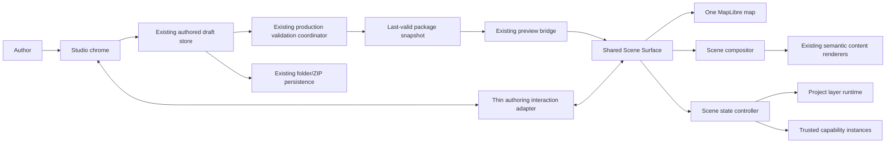

# Map Story Studio V1.1 — Desktop Architectural Design

Status: proposed for human review

Date: 2026-08-30

Authoritative repository base: `main` at `119ed58d5d57e38474fee192effe9028e6a0c2d7`

Locked production authority: `docs/baseline-authoring-contract-v1.md`

GUI Editor V1 certification: `review/gui-editor-v1/REPORT.md`

## 1. Decision summary

Map Story Studio V1.1 changes the product from a schema-oriented project editor into a desktop-first visual Scene authoring environment while preserving the certified production architecture underneath it.

The product model is:

> PowerPoint-like authoring + Mapbox/MapLibre-style storytelling output.

A Scene is still a Story state. There is no second slide runtime and no GUI-only document model. Story Schema 1.2 additively extends the production Story format so that a Scene can declaratively own its camera, interaction policy, transition, project-layer visibility, and a constrained freeform 16:9 overlay composition.

The editor remains a client of the existing package store, draft store, production validators, production project loader, trusted capability registry, storage adapters, and shared production preview. The V1.1 work changes the authoring surface and adds a shared Scene compositor/state controller; it does not replace the certified V1 persistence or project-loading spine.

The generic production shell becomes neutral. Route 61-2 remains a reference project and compatibility fixture, but route comparison, POI emphasis, urban context, simulation, and other route-specific behavior must live in trusted capabilities or Route 61-2 project data rather than generic shell markup or generic application logic.

V1.1 is desktop/projector first. Mobile authoring and mobile-specific authored layouts are explicitly deferred.

## 2. Repository evidence and current boundary

The approved direction is compatible with the current repository and addresses a concrete architectural debt.

At the authoritative base:

- `BASELINE_AUTHORING_CONTRACT_V1` is locked.
- `PROJECT_MANIFEST_V1` remains the project manifest authority.
- Story Schema 1.0 and 1.1 are the supported production Story versions.
- `CORE_CONTENT_PACK_V1` owns the semantic content descriptors and production renderers.
- `COMMON_MAP_ACTIONS_V1` owns the existing semantic map actions.
- `DATA_METRIC_BINDING_V1` owns table/static/computed metric binding and locale formatting.
- `CAPABILITY_EXTENSION_BOUNDARY_V1` owns trusted domain-specific extensions.
- GUI Editor V1 has certified folder/ZIP persistence, production validation, last-valid preview behavior, package export/reopen, and no GUI-only schema.
- `src/application.js` and `src/project/bootstrap.js` already provide a useful generic load/bootstrap seam.
- `src/story-schema.js` cleanly versions Story validation.
- `src/content/content-descriptors.js` already provides reusable semantic descriptors for heading/paragraph, metrics, chart, table, image, legend, and the other existing content types.

The present production entry path is not yet neutral. `src/app.js` still constructs Route 61-2 route/stops/POI data, comparison state, transport metrics, industrial context, route reveal behavior, bus simulation behavior, and project-specific control state. V1.1 removes those assumptions from the generic shell without breaking the existing Route 61-2 Story 1.0 artifact.

## 3. Product goals

V1.1 succeeds when a desktop user can build an ordinary map story primarily by manipulating visible objects on a live 16:9 map Scene rather than navigating engine vocabulary.

The primary authoring concepts are:

- **Layers** — project-level map resources;
- **Scenes** — ordered Story states;
- **Canvas** — the live 16:9 MapLibre Scene surface;
- **Properties** — contextual controls for the selected Scene, layer, or overlay object.

The normal user should not have to understand metrics namespaces, focus-target registries, capability internals, action arrays, block arrays, Story version mechanics, attribution wiring, validator paths, or raw schema vocabulary in order to create an ordinary Story 1.2 project.

Those concepts remain available only where required by engine behavior, imported legacy projects, trusted capability configuration, or Problems/Advanced surfaces.

The authoritative composition is 16:9 and targets:

- desktop authoring at approximately 1440×900 or larger;
- 1920×1080 projector/presentation output;
- 1366×768 laptop output.

## 4. Explicit non-goals

V1.1 does not become a general presentation/design application.

The following are out of scope:

- mobile editor UI;
- mobile-specific authored Scene layouts;
- arbitrary vector drawing or shapes;
- freehand drawing;
- rotation of overlay objects;
- grouping;
- master slides;
- SmartArt;
- Figma-style constraint systems;
- arbitrary CSS;
- arbitrary JavaScript or executable authored configuration;
- raw MapLibre style expressions or private source/layer IDs;
- visual programming of capabilities;
- arbitrary plugin installation from project content;
- GIS geometry editing, route snapping, spatial analysis, or QGIS replacement;
- automatic Story 1.0/1.1 migration;
- a general 1.0/1.1-to-1.2 conversion engine;
- a second presentation runtime;
- a second editor-only content renderer;
- backend/cloud project persistence or multi-user collaboration.

Image cropping/focal-point editing is also deferred. V1.1 image objects use bounded declared assets and a deterministic `contain` fit inside their authored frame.

## 5. Locked invariants and compatibility policy

The following are architectural gates, not preferences.

### 5.1 Existing contracts remain authoritative

V1.1 preserves:

- `PROJECT_MANIFEST_V1`;
- `CORE_CONTENT_PACK_V1`;
- `COMMON_MAP_ACTIONS_V1`;
- `DATA_METRIC_BINDING_V1`;
- `CAPABILITY_EXTENSION_BOUNDARY_V1`;
- the production project loader;
- the installed trusted capability registry;
- existing folder/ZIP persistence semantics;
- production validation as the only validity authority.

Story 1.2 is an additive Story minor version. It does not redefine Story 1.0 or 1.1.

### 5.2 No silent migration

Opening, editing an unrelated resource, saving, exporting, or previewing a Story 1.0 or 1.1 project must not change its Story `schemaVersion` or rewrite it as Story 1.2.

The canonical Route 61-2 Story 1.0 file remains byte-identical unless a later explicitly approved change says otherwise.

Story 1.0 and 1.1 continue to render through their existing structured presentation layouts. V1.1 preserves the certified structured/legacy inspector for those versions; freeform Scene manipulation is enabled only for Story 1.2 `freeform-16x9` content.

A future explicit migration tool is a separate product decision.

### 5.3 No GUI-only schema

Every saved V1.1 authoring change is production Story 1.2, existing project-manifest data, an existing bounded resource descriptor, or trusted capability settings.

Selection, hover, handles, unsaved working camera, alignment guides, panel widths, current editor mode, preview state, history stacks, and storage handles remain editor-only memory and never enter project JSON.

### 5.4 One runtime and one semantic renderer set

Editor authoring, scroll-story output, and presentation output share the production Scene/state controller and production content renderers.

The editor may add authoring affordances around the production Scene surface, but it must not simulate or independently reimplement the rendered result.

## 6. Terminology mapping

| Product term | Production/runtime meaning |
| --- | --- |
| Project | Existing `PROJECT_MANIFEST_V1` package plus declared resources |
| Scene | Story `state` |
| Layers panel | Map-renderable project datasets/resources exposed through stable project IDs |
| Overlay object | Story 1.2 composed semantic block envelope |
| Canvas | Shared live MapLibre Scene surface with 16:9 overlay coordinate space |
| Properties | Contextual authoring controls that write production values |
| Preview Story | Scroll-story experience using the current last-valid package snapshot |
| Present | Projector/presentation experience using the same Scene sequence |
| Problems | Production validation diagnostics plus non-fatal authoring/layout warnings |
| Advanced | Legacy Story/action/capability details that are not routine V1.1 authoring concepts |

The GUI term **Scene** must not cause a second data model. Scene ordering is still `story.states` array order and Scene IDs are existing Story state IDs.

## 7. Desktop workspace

The target shell is:

```text
┌───────────────────────────────────────────────────────────────┐
│ Project       Undo Redo      Preview Story  Present  Save    │
├────────────┬───────────────────────────────────┬──────────────┤
│ LAYERS     │                                   │ PROPERTIES   │
│            │         16:9 LIVE MAP             │              │
│ Route      │                                   │ contextual   │
│ Stops      │      freeform overlays            │ inspector    │
│ Zones      │                                   │              │
│ + Add      │                                   │              │
├────────────┴───────────────────────────────────┴──────────────┤
│ SCENES  [01] [02] [03] [04] [+]                            │
└───────────────────────────────────────────────────────────────┘
```

The canvas is the primary work surface.

### 7.1 Top bar

The normal top bar contains project open/create commands, Undo, Redo, Preview Story, Present, Save/Export as appropriate, and compact validation/dirty status.

Validation is not a primary authoring destination. Fatal errors and warnings surface through a Problems affordance/drawer that reuses the certified production-diagnostic navigation infrastructure.

### 7.2 Layers panel

The Layers panel shows human labels for project-level map resources. Internal stable dataset IDs may be visible only in Advanced/details UI.

A visibility checkbox edits the active Scene's declarative layer-visibility snapshot immediately.

Selecting a layer changes the Properties panel to global project-layer properties such as label and bounded render style. Global style edits affect that layer in every Scene; visibility remains Scene-specific.

### 7.3 Scene filmstrip

The bottom filmstrip shows ordered Scenes with ordinal and a concise label derived from visible content where possible. Empty Scenes fall back to `Scene N`.

The filmstrip supports selection, add, duplicate, delete, and reorder. Reordering writes `story.states` array order. Existing accessible Move Previous/Move Next behavior remains available as a keyboard-safe fallback even if drag reordering is added.

**Add Scene** creates an empty overlay composition and copies the active Scene's saved camera, interaction policy, and layer-visibility snapshot so the author starts from the current map context. Its transition is the V1.1 default `ease` at `900ms`. If there is no active Scene, the camera comes from `project.map.initialView`, interaction defaults to `locked`, and every existing project layer starts hidden unless the selected template explicitly seeds another state.

**Duplicate Scene** copies the entire active Scene, then generates a new stable Scene ID. Deleting the only remaining Scene is disallowed because Stories remain non-empty.

### 7.4 Properties panel

The Properties panel is strictly contextual:

- no selection: Scene properties;
- selected overlay: semantic content + frame/appearance controls;
- selected layer: project layer properties and active-Scene visibility;
- Map mode/camera changed: camera status and Capture/Restore controls.

Engine-oriented fields remain demoted.

## 8. Shared production/editor architecture

The certified GUI Editor V1 package, draft, validation, storage, and preview boundaries remain valuable and should be extended rather than replaced.



The editor parent remains package/draft authority. The embedded/shared Scene surface remains rendering authority.

### 8.1 Authoring interaction adapter

The editor may not create a parallel renderer merely to support drag/resize.

A thin authoring adapter is active only in editor-preview mode. It may:

- draw selection outlines and resize handles around production overlay wrappers;
- perform transient drag/resize visuals;
- expose direct text editing for supported Text objects;
- report a camera working snapshot;
- emit bounded authoring intents such as `commit frame`, `commit text`, or `capture camera` to the parent editor.

The parent editor commits those intents as Story 1.2 production-data mutations, then revalidates and advances the last-valid preview normally.

Transient pointer movement is not authored state. A drag/resize becomes one authored mutation on pointer-up rather than hundreds of package revisions.

The existing strict preview origin/source/envelope checks remain in force. No raw DOM, MapLibre object, function, or file handle crosses the bridge.

## 9. Story Schema 1.2 contract

Story 1.2 is the only new production authoring schema required for freeform Scene composition.

The Story root keeps the existing required concepts: `schemaVersion`, `id`, `title`, and a **non-empty** ordered `states` array. Story 1.2 changes the version value to `"1.2"`; it does not add a parallel root document model.

Story 1.2 states continue to use the existing `id`, `content`, and `map` structural concepts. The new fields are version-gated and do not change validation of Story 1.0/1.1.

### 9.1 Story 1.2 Scene shape

A Story 1.2 Scene is conceptually:

```json
{
  "id": "context",
  "content": {
    "layout": "freeform-16x9",
    "blocks": [],
    "presenterNote": "Optional, not rendered"
  },
  "map": {
    "camera": {
      "center": [106.67, 10.98],
      "zoom": 12.5,
      "pitch": 35,
      "bearing": 0
    },
    "interaction": "locked",
    "transition": {
      "type": "ease",
      "durationMs": 900
    },
    "layerVisibility": {
      "existing-route": true,
      "proposed-route": false,
      "stops": false
    },
    "enter": [],
    "exit": []
  }
}
```

`map.enter` and `map.exit` remain the trusted action lifecycle for special behavior. New Story 1.2 projects may legitimately use empty arrays.

Unlike Story 1.0/1.1, Story 1.2 `freeform-16x9` permits `content.blocks` to be empty so a genuinely blank map Scene is valid.

### 9.2 Declarative camera

`map.camera` is required for a Story 1.2 freeform Scene and contains:

- `center`: exactly two finite numbers `[lng, lat]` within normal geographic bounds;
- `zoom`: 0–24;
- `pitch`: 0–72;
- `bearing`: -360–360.

Captured bearing is normalized to a canonical equivalent before writing so repeated capture does not create meaningless numeric drift.

The project manifest `map.initialView` remains the initial/fallback map view and the source for the first blank Scene. Once a Story 1.2 Scene is active, the Scene camera is authoritative.

### 9.3 Interaction policy

`map.interaction` is required and is one of:

- `locked`;
- `zoom-only`;
- `explore`.

`locked` disables user map navigation.

`zoom-only` allows bounded zoom interaction but no free pan, pitch, or rotation. In scroll-story output, normal wheel scrolling must remain available for page/Scene navigation; zoom uses cooperative gestures or explicit zoom controls rather than trapping ordinary scroll.

`explore` allows normal MapLibre exploration appropriate to the active output while retaining cooperative scrolling in scroll-story mode.

The editor's Select/Map authoring mode is not this property and is never serialized.

### 9.4 Transition

`map.transition` is required and contains:

- `type`: `fly`, `ease`, or `instant`;
- `durationMs`: integer 0–10000.

`instant` must use `durationMs: 0`.

The V1.1 default for a newly created Scene is `ease` with `durationMs: 900`; templates may explicitly author another valid transition. Runtime behavior therefore never depends on an unversioned hidden duration.

When reduced motion is requested by the platform, the runtime must render authored `fly`/`ease` transitions as instant while leaving authored data unchanged.

### 9.5 Layer visibility snapshot

`map.layerVisibility` maps stable project dataset IDs to booleans. It never contains private MapLibre source IDs or layer IDs.

For each Story 1.2 Scene, it is a complete snapshot of the project's Scene-controllable map-layer resources. This produces deterministic back/forward navigation and prevents visibility leakage from a prior Scene.

The Scene-controllable set is composed of project GeoJSON resources that are rendered by the core map renderer or explicitly claimed as renderable project resources by a trusted installed capability.

Cross-resource production validation must reject:

- unknown dataset IDs;
- table-dataset IDs or other IDs that are not Scene-controllable map resources;
- missing visibility entries for Scene-controllable project layers.

When a new map layer is added through V1.1, the editor updates all Story 1.2 Scenes atomically so the project remains explicit and valid. The new layer is visible in the active Scene and hidden in other existing Story 1.2 Scenes unless a template-specific creation operation explicitly defines another initial snapshot. Legacy Story 1.0/1.1 data is untouched.

### 9.6 Special actions remain actions

Routine Scene camera, layer visibility, interaction, and transition are not authored as action arrays in normal V1.1 UI.

Trusted actions remain for special/domain behavior such as:

- route reveal;
- route comparison/difference effects;
- POI emphasis;
- industrial/urban context;
- vehicle simulation;
- future specialized effects.

`COMMON_MAP_ACTIONS_V1` remains valid and supported, especially for Story 1.0/1.1 compatibility. If an advanced Story 1.2 author deliberately uses a core map action that overlaps declarative Scene state, activation order is deterministic: the declarative Scene baseline is applied first, then `map.enter` actions run and may intentionally override it. The normal V1.1 GUI does not author such overlapping routine actions.

## 10. Composed semantic blocks

Story 1.2 does not add a replacement semantic content system.

Instead, each item in `content.blocks` is a **composition envelope** around an existing semantic block.

Conceptually:

```json
{
  "id": "title",
  "frame": {
    "x": 0.05,
    "y": 0.08,
    "width": 0.40,
    "height": 0.17,
    "z": 20
  },
  "appearance": {
    "box": {
      "fill": "#07101CCC",
      "opacity": 1,
      "borderColor": "#FFFFFF22",
      "borderWidth": 1,
      "radius": 16,
      "padding": 24
    },
    "text": {
      "fontFamily": "sans",
      "fontSize": 50,
      "bold": true,
      "italic": false,
      "color": "#F6F8FC",
      "align": "left",
      "lineHeight": 1.1
    }
  },
  "block": {
    "type": "heading",
    "text": "Existing route context"
  }
}
```

The nested `block` is validated by the existing semantic descriptor for its `type`. The envelope is validated by Story 1.2 composition rules.

This separation is deliberate:

- Story 1.0/1.1 block descriptors do not gain editor-only fields;
- existing table/chart/image/legend/metric renderers remain reusable;
- freeform position/appearance is a compositor concern;
- semantic data remains semantic data.

### 10.1 Stable composed-block ID

Each composition envelope requires a stable lowercase ID unique within its Scene. The ID is production data because it provides deterministic DOM identity and authoring selection without relying on array index.

The normal GUI does not require users to edit this ID.

### 10.2 Frame contract

`frame` is required and contains:

- `x`: normalized horizontal origin 0–1;
- `y`: normalized vertical origin 0–1;
- `width`: normalized width greater than 0 and at most 1;
- `height`: normalized height greater than 0 and at most 1;
- `z`: integer stacking order 0–9999.

Production validation additionally enforces:

- `x + width <= 1`;
- `y + height <= 1`.

V1.1 does not author off-canvas objects.

If two objects have the same `z`, Story array order is the deterministic tie-breaker.

Users never type normalized coordinates in normal UI. Drag, resize, alignment, and keyboard nudge commands write these values.

### 10.3 16:9 design coordinate system

Frame geometry is normalized against the 16:9 Scene.

Appearance measurements that need physical size, such as font size, border width, radius, and padding, use **design pixels** referenced to a 1920×1080 logical Scene. The compositor scales them uniformly with the rendered 16:9 Scene width.

This keeps authored typography and box treatment proportional when the same Scene is shown at 1920×1080, 1366×768, or as a smaller editor canvas.

The map itself renders natively at the actual MapLibre viewport size; authored camera values remain standard MapLibre camera values rather than design-pixel abstractions.

### 10.4 Appearance contract

`appearance` is optional. Omitted fields use production compositor defaults rather than hidden editor-specific styling.

`appearance.box` may contain only bounded values for:

- `fill`: bounded hex color, including alpha;
- `opacity`: 0–1 for the whole object;
- `borderColor`: bounded hex color, including alpha;
- `borderWidth`: 0–16 design px;
- `radius`: 0–128 design px;
- `padding`: 0–160 design px.

`appearance.text` may contain only:

- `fontFamily`: approved application token;
- `fontSize`: 8–256 design px;
- `bold`: boolean;
- `italic`: boolean;
- `color`: bounded hex color, including alpha;
- `align`: `left`, `center`, or `right`;
- `lineHeight`: 0.8–2.5.

The initial V1.1 font-family tokens are:

- `sans` — current Inter/system sans stack;
- `arial` — Arial/Helvetica-style sans stack;
- `times-new-roman` — Times New Roman/Times-style serif stack;
- `georgia` — Georgia-style serif stack.

No authored font URL, `@font-face`, arbitrary CSS family string, or remote stylesheet is permitted.

Typography controls are fully supported for Text objects. Box appearance is supported for all overlay objects. Metric/table/legend text may inherit safe wrapper typography where the existing semantic renderer naturally supports inheritance, but V1.1 does not add arbitrary styling of chart internals or table cells. Chart series styling remains the existing bounded semantic chart descriptor.

### 10.5 Initial visible object families

The V1.1 Add menu exposes these product-level object families:

- **Text** — backed by existing `heading` or `paragraph` semantic blocks; the Text family offers `Heading` and `Body text` subtypes rather than inventing a new semantic block type;
- **Metric** — backed by existing `stat-group` semantic block;
- **Chart** — existing Chart.js-backed `chart` block;
- **Table** — existing normalized `table` block;
- **Image** — existing declared-asset `image` block;
- **Legend** — existing `legend` block.

Story 1.2 accepts every existing `CORE_CONTENT_PACK_V1` semantic block type inside a composition envelope so renderer/descriptor compatibility stays complete. The primary Add menu exposes only the six product-level families above in V1.1.

PR B proves the composition system with Text before rich objects are enabled.

## 11. Camera authoring — explicit capture only

Camera authoring is a first-class product feature and must never use implicit save-on-map-move behavior.

### 11.1 Editor interaction modes

The editor has two transient authoring modes.

**Select mode** is the default:

- overlay selection is enabled;
- drag and resize are enabled;
- direct text editing is enabled;
- alignment commands are enabled;
- ordinary map pan/rotate/pitch is disabled so the canvas cannot move accidentally.

**Map mode**:

- overlay manipulation is suspended;
- pan, zoom, pitch, and rotate are enabled for authoring exploration;
- the active Scene's saved camera remains unchanged until explicit capture.

These modes are editor state only.

### 11.2 Working camera lifecycle

On entering or while using Map mode:

1. the editor compares the live map camera with the active Scene's saved camera;
2. if they differ, the canvas shows an obvious `Camera changed · not captured` status;
3. **Capture Camera** reads the live MapLibre camera, normalizes/clamps it to the Story 1.2 camera contract, and commits one Scene mutation;
4. **Restore Saved Camera** returns the live map to the authored Scene camera without changing Story data;
5. switching Scenes discards any uncaptured working camera and restores the target Scene's saved camera.

No pan, zoom, rotate, pitch, `moveend`, or other MapLibre event is allowed to mutate authored camera data directly.

Capture Camera is one undoable authoring command.

### 11.3 Scene switching during authoring

Normal editor Scene switching restores the saved Scene camera, saved layer-visibility snapshot, saved overlay composition, and Scene properties immediately. The editor does not force the author to sit through the configured presentation transition during routine editing.

Preview Story and Present honor the configured transition.

## 12. Project Layers and Scene visibility

Layers remain project resources rather than Scene-local duplicated data.

### 12.1 Project-layer runtime boundary

The generic runtime needs a small semantic layer-control boundary keyed by project dataset ID.

Core map rendering registers each ordinary project GeoJSON layer with operations equivalent to:

- `setVisible(datasetId, boolean)`;
- `reset()`/restore baseline as needed;
- destroy lifecycle.

A trusted capability that claims rendering responsibility for a project dataset must register the same stable project dataset ID with the Scene layer controller. It may internally control multiple MapLibre sources/layers, but those private IDs never leave trusted code.

This is glue around the existing capability boundary, not a new authored framework.

Capability-generated visuals that do not correspond to an ordinary project dataset are not automatically promoted into the Layers panel. They remain special capability behavior unless the trusted capability intentionally publishes a stable authorable project-layer target.

### 12.2 Layer authoring behavior

Toggling a Layer checkbox:

- changes only the active Scene's `map.layerVisibility` value;
- updates the live production Scene surface immediately;
- creates one undoable authored mutation;
- never writes `map.set-visibility` actions.

Changing a project's line color, width, fill, point radius, label descriptor, or other existing bounded render property remains a project-level edit and affects every Scene in which that layer is visible.

Deleting a layer uses existing reference-safety/validation behavior and must surface every broken Scene/action/capability reference rather than silently repairing it.

## 13. Freeform composition behavior

V1.1 uses constrained PowerPoint-like composition, not unrestricted design-tool behavior.

### 13.1 Direct manipulation

For a selected overlay, the canvas provides:

- drag within the 16:9 bounds;
- resize handles constrained to the Scene bounds;
- duplicate;
- delete;
- bring forward;
- send backward;
- basic alignment commands;
- basic snapping and alignment guides.

The first snapping set is intentionally small:

- Scene edges;
- Scene horizontal/vertical centers;
- other object edges;
- other object horizontal/vertical centers.

Guides are transient UI and are never persisted.

V1.1 does not add arbitrary user-created guide lines, distribution algorithms, grouping, or constraint graphs.

### 13.2 Direct text editing

Text objects support direct editing on canvas. Semantic editing remains bounded text content; no HTML, Markdown execution, inline CSS, or rich-text DOM fragments are stored.

Text edits commit as production semantic block changes. The Properties panel may expose the same text plus typography/appearance controls.

### 13.3 Overflow

The compositor does not silently auto-resize or reflow an object's frame to hide authoring mistakes.

If rendered content exceeds its frame, the editor surfaces a non-fatal layout warning and the author may resize/rewrite the object. Production rendering remains deterministic and clips/contains according to the object renderer rather than inventing a different layout.

Chart canvases resize to their authored frame through the existing responsive chart renderer. Images use `contain`. Tables that cannot fit their frame surface an overflow warning rather than turning presentation output into a spreadsheet viewport.

## 14. Undo and Redo

Undo/Redo is bounded to authored production-data mutations made since the project was opened/created in the current editor session.

Examples of one undoable command:

- Capture Camera;
- Layer visibility toggle;
- drag commit;
- resize commit;
- direct text commit;
- appearance change;
- add/delete/duplicate/reorder Scene;
- add/delete/duplicate overlay.

Undo/Redo does not include:

- selection;
- hover;
- Select/Map mode changes;
- uncaptured map exploration;
- preview navigation;
- Problems panel state;
- storage permission prompts;
- Save/Export commands.

Save marks package bytes clean but does not erase authoring history. Undo after Save creates a new dirty production mutation normally.

The implementation may use bounded immutable snapshots or inverse commands, but the history mechanism must remain editor memory and must not change production schemas.

## 15. Scene activation and runtime precedence

Story Runtime remains responsible for ordered state lifecycle. V1.1 adds a shared Scene-state application layer around that lifecycle rather than replacing it.

On transition from Scene A to Scene B, the runtime order is:

1. run Scene A `map.exit` trusted actions;
2. cancel any in-flight camera transition owned by Scene A;
3. apply Scene B's complete declarative layer-visibility baseline;
4. apply Scene B's authored interaction policy;
5. render/activate Scene B's overlay composition;
6. initiate Scene B's declared camera transition toward its saved camera;
7. run Scene B `map.enter` trusted actions.

Steps 3–6 establish the ordinary presentation baseline. Step 7 allows trusted special behavior to deliberately refine that baseline.

Re-entering a Scene always re-applies the complete declarative baseline, so back/forward navigation cannot inherit stray layer state from another Scene.

The camera animation may continue after `map.enter` begins; activation must not block Story navigation for the transition duration.

## 16. Generic production shell

The generic application shell contains only generic platform elements:

- MapLibre map container;
- Scene compositor root;
- scroll-story navigation/activation host;
- presentation navigation host;
- generic loading/error/status affordances;
- trusted capability-control host slots.

It contains no Route 61-2 labels, no Existing/Proposed/Difference tabs, no transport metrics, no bus simulation controls, and no industrial/urban controls.

A blank project loaded through the same production shell must therefore show only its basemap/blank Scene and generic navigation appropriate to its Story.

### 16.1 Trusted capability control slots

Some trusted capabilities legitimately need project-specific runtime controls. The generic shell may expose neutral named host elements to trusted capability implementations.

A capability implementation may mount trusted controls into those hosts through lifecycle context supplied by production bootstrap. The control markup/behavior lives in trusted application code, not project JSON.

If no installed project capability contributes controls, the host remains empty/hidden.

This preserves `CAPABILITY_EXTENSION_BOUNDARY_V1`: executable UI behavior remains installed trusted code and project content contains only validated capability IDs/settings/data.

## 17. Route 61-2 reference-project boundary

Route 61-2 remains important as the benchmark artifact, but no longer defines generic platform behavior.

The target composition is:

```text
Generic Runtime / Generic Shell
+ Core Content
+ Core Map
+ Route Comparison capability
+ Transport/POI behavior where required
+ Urban Context capability where required
+ Route 61-2 project datasets/settings
+ Route 61-2 Story
```

The canonical Route 61-2 Story 1.0 continues to validate and execute through legacy action normalization and trusted capabilities.

Route-specific adapters required only to preserve the existing Story 1.0 experience may remain trusted compatibility code, but they must not be imported or assumed by generic shell code.

By the end of V1.1:

- generic shell source contains no Route 61-2 data constants or labels;
- blank-project certification uses the same shell successfully;
- Route 61-2 still runs as a project loaded by that shell;
- route-specific controls, simulation, POI emphasis, urban context, and derived route-comparison rendering are capability-owned;
- the existing Route 61-2 Story 1.0 artifact remains unchanged.

If a Story 1.2 Route 61-2 demonstration is needed for the Studio reference experience, it must be a separate explicitly authored reference/template artifact rather than a silent rewrite of the canonical Story 1.0 file.

## 18. Templates

A template creates ordinary project content once. It has no runtime role after project creation.

No `templateId`, template engine metadata, or template-specific runtime branch is persisted.

Every new V1.1 Studio project defaults to Story 1.2. Story 1.1 remains supported for existing/imported projects but is no longer the default new-project Story format.

V1.1 creation choices are intentionally limited to:

1. **Blank map story**;
2. **Route proposal**;
3. **Network / service plan**;
4. **Import existing project**.

Import existing project reuses the certified Open Folder / Import ZIP paths and is not a special on-disk format.

### 18.1 Blank map story

Creates:

- ordinary `PROJECT_MANIFEST_V1`;
- one Story 1.2 file;
- one empty `freeform-16x9` Scene;
- no project map layers;
- no route-specific capabilities;
- no sample transport metrics or controls.

### 18.2 Route proposal

Creates neutral starter project data and installs only the trusted capabilities required by the starter structure. It must not contain Route 61-2 labels or data.

Starter Scenes are:

- Context;
- Existing route;
- Proposed change;
- Key connection;
- Recommendation.

They are normal editable/deletable Story 1.2 Scenes after creation.

### 18.3 Network / service plan

Creates neutral starter Scenes/layers suitable for a network/service planning narrative using the same generic Scene format. It does not create a new runtime mode.

Templates may seed layer visibility, camera, starter overlays, and relevant trusted capability declarations, but every resulting value is ordinary production project/Story data.

## 19. Desktop outputs from the same Scene sequence

There is one Story 1.2 Scene sequence and two production desktop experiences.

### 19.1 Scroll Story

Scroll Story is Mapbox-style storytelling:

- one immersive live MapLibre background;
- Scene activation driven by scroll position;
- active Scene applies camera/layer/interaction/transition state;
- active Scene displays the authored overlay composition;
- trusted capability enter/exit effects may run;
- no editor chrome.

On a non-16:9 desktop viewport, the map remains full-bleed while overlay geometry is resolved against the largest centered 16:9 composition-safe rectangle. The required V1.1 certification viewports are both effectively 16:9, so certified output is exact to the authored composition.

Scroll containers must not cause `zoom-only` or `explore` map interaction to trap ordinary page scrolling. Cooperative map gestures remain mandatory.

### 19.2 Presentation mode

Presentation mode is projector-oriented:

- exact 16:9 Scene stage;
- MapLibre fills the stage;
- authored overlays render in the same positions as the editor canvas;
- Next/Previous controls;
- keyboard navigation;
- configured camera/layer transitions;
- authored interaction policy;
- trusted capability effects;
- no editor chrome.

If the browser/screen is not 16:9, the presentation stage is centered with neutral letterbox/pillarbox space rather than stretching the authored composition.

### 19.3 Shared implementation rule

Scroll Story and Presentation mode must use the same:

- Story definition;
- Scene-state controller;
- Layer runtime;
- MapLibre map creation path;
- overlay compositor;
- semantic content renderers;
- capability instances/action contracts.

Only the navigation/activation shell differs.

## 20. Editor Preview Story and Present

The editor's **Preview Story** and **Present** commands use the current last-valid in-memory package snapshot. The user does not need to Save first to test a valid unsaved change.

A fatal production validation error preserves the existing last-valid preview behavior and clearly indicates that preview/presentation is using the prior valid revision.

Editor authoring Scene switching is immediate. Preview Story/Present are the places where authored transitions, scroll activation, keyboard navigation, and runtime interaction policy are tested.

## 21. Persistence and validation

GUI Editor V1 persistence behavior is preserved.

- Folder Open reads `project.json` and declared resources only.
- Folder Save writes only changed managed entries in deterministic order with `project.json` last.
- ZIP import/export preserves existing safety limits and safe pass-through behavior.
- Export remains blocked by fatal production validation errors.
- Save may preserve an invalid repairable draft only through the existing explicit confirmation policy.
- Story 1.0/1.1 files not mutated by the user preserve original bytes.
- No hidden project database or IndexedDB project authority is introduced.

New Story 1.2 validation extends, rather than bypasses, the production validation coordinator. The Problems UI may add non-fatal editor/layout warnings such as content overflow, but those warnings are clearly distinguished from production schema/reference errors.

## 22. Security and trust boundary

V1.1 preserves the existing data-only authoring boundary.

Story 1.2 may contain only bounded serializable data. It may not contain:

- JavaScript;
- functions/callbacks;
- HTML fragments;
- arbitrary CSS;
- CSS URLs;
- MapLibre expressions;
- MapLibre source/layer IDs;
- DOM selectors;
- module URLs;
- remote plugins;
- filesystem handles;
- editor history/selection state.

Trusted executable behavior remains installed application code selected through the existing capability registry.

The preview bridge remains origin/source checked and revision correlated. Authoring interaction messages are bounded semantic intents, not arbitrary method invocation.

## 23. Accessibility and desktop usability

V1.1 remains desktop-first but must preserve keyboard-operable authoring for primary commands.

Minimum requirements include:

- keyboard Scene selection and reordering fallback;
- keyboard access to Select/Map mode;
- keyboard-accessible Capture Camera and Restore Saved Camera;
- keyboard selection/delete/duplicate/z-order/alignment commands for overlay objects;
- arrow-key nudge for selected overlay position so drag is not the only positioning mechanism;
- visible focus state;
- Problems diagnostics that navigate to the relevant Scene/object/property where possible;
- production semantic content accessibility from existing table/chart/image renderers;
- presentation Next/Previous keyboard navigation;
- Escape behavior that exits presentation/chrome overlays predictably.

The author is never required to type normalized coordinates.

## 24. Performance and rendering constraints

V1.1 preserves the one-map principle.

For any single active editor Scene surface or production output:

- exactly one MapLibre instance is mounted;
- Scene switching reuses that instance;
- overlays are DOM/content renderer objects over the map;
- drag/resize uses transient transforms and commits once at interaction end;
- expensive production validation/package replacement is not performed on every pointer-move event;
- chart instances are created/destroyed through the existing renderer lifecycle rather than leaked across Scene changes.

Desktop certification must cover 1920×1080 and 1366×768 and show no material regression from the current settled interactive performance target. The intended steady-state target remains smooth 60 FPS-class presentation on the existing Route 61-2 benchmark hardware/content where the browser/GPU can sustain it.

V1.1 does not spend implementation scope certifying a mobile editor.

## 25. Delivery slices

The approved work is intentionally staged. Each PR must be reviewable and must preserve the certified V1 engine/persistence boundary.

### PR A — Generic neutral shell + Story 1.2 Scene Camera

Scope:

- introduce the neutral generic production shell path and prove it with a blank Story 1.2 project;
- keep any still-required Route 61-2 legacy entry/adapter isolated from those neutral modules until PR C rather than forcing the full Route 61-2 conversion into PR A;
- Story 1.2 base validation/contract;
- declarative camera;
- explicit camera capture/restore authoring behavior;
- declarative per-Scene project-layer visibility;
- authored interaction policy;
- authored transition;
- Scene switching/restoration;
- minimal desktop Scene filmstrip;
- trusted capability host/layer-control seam required to keep future project-specific behavior out of the neutral shell.

Do not build rich freeform composition or perform the full Route 61-2 reference-project conversion in this PR.

### PR B — Desktop PowerPoint compositor

Scope:

- shared 16:9 compositor;
- Story 1.2 composition envelope;
- Text object first;
- direct text editing;
- drag/resize;
- normalized frame persistence;
- typography and box appearance;
- z-order;
- basic snapping/alignment;
- bounded undo/redo for the new authoring interactions.

Text composition is the proof gate. Do not add all rich objects until this path is stable.

### PR C — Rich content + templates + Route 61-2 reference conversion

Scope:

- Metric;
- Image;
- Chart;
- Table;
- Legend;
- Blank map story template;
- Route proposal template;
- Network/service plan template;
- Import existing project entry point;
- move Route 61-2 fully onto the neutral shell through trusted capabilities/project data;
- separate Story 1.2 Route 61-2 reference artifact only if needed, without modifying the canonical Story 1.0 artifact.

### PR D — Desktop outputs + certification

Scope:

- Scroll Story;
- Presentation mode;
- output navigation/keyboard behavior;
- transition and interaction-policy verification;
- persistence/export/reopen of Story 1.2 composition;
- 1920×1080 certification;
- 1366×768 certification;
- performance/lifecycle checks;
- neutral blank-project check;
- Route 61-2 compatibility check;
- final V1.1 desktop lock/certification report.

Mobile is a later separately designed phase after desktop V1.1 lock.

## 26. Acceptance and certification gates

The following are required before Map Story Studio V1.1 desktop can be considered complete.

### 26.1 Compatibility gates

- Story 1.0 production tests pass unchanged.
- Story 1.1 production tests pass unchanged.
- Canonical Route 61-2 Story 1.0 bytes are unchanged.
- Unrelated Save/Export does not migrate 1.0/1.1.
- `PROJECT_MANIFEST_V1` remains accepted unchanged.
- Existing GUI Editor V1 folder/ZIP package tests remain passing.
- No GUI-only serialized fields exist.

### 26.2 Generic-shell gates

A blank Story 1.2 project loaded through the same neutral production shell has:

- one MapLibre map;
- no Existing/Proposed/Difference tabs;
- no transport metrics;
- no bus simulation controls;
- no industrial/urban controls;
- no Route 61-2 labels;
- no Route 61-2 modules required by the neutral shell path.

By PR C/D, Route 61-2 loaded through that same shell still presents its trusted domain behavior.

### 26.3 Camera gates

- map movement alone produces zero Story mutations;
- Camera changed status appears after live camera divergence;
- Capture Camera performs exactly one authored camera mutation;
- Restore Saved Camera performs zero authored mutations;
- Scene switch restores saved camera;
- leaving/re-entering a Scene never restores an uncaptured working camera;
- Preview Story/Present honor Fly/Ease/Instant and duration;
- reduced-motion fallback does not mutate authored transition data.

### 26.4 Layer gates

- layer visibility is stored per Scene in Story 1.2;
- switching Scenes restores a complete visibility snapshot;
- ordinary layer visibility changes do not author action arrays;
- project layer styling remains global across Scenes;
- capability-owned renderers honor visibility through stable project dataset IDs;
- no raw MapLibre ID enters project/Story JSON.

### 26.5 Composition gates

- editor canvas is a true 16:9 Scene surface;
- Text can be added, selected, directly edited, dragged, resized, duplicated, deleted, aligned, and reordered in z;
- frame data is normalized and bounded;
- typography/box appearance is constrained and deterministic;
- editor uses the same production semantic renderer path;
- no arbitrary CSS/HTML/JS is serialized;
- Metric/Image/Chart/Table/Legend reuse existing semantic descriptors/renderers;
- chart/table/image/legend accessibility behavior remains intact;
- overflow is surfaced rather than silently changing authored layout.

### 26.6 Output gates

The same Story 1.2 file produces both Scroll Story and Presentation mode.

At 1920×1080 and 1366×768:

- camera state is correct;
- layer state is correct;
- overlay geometry matches the 16:9 composition;
- navigation is correct;
- interaction policy is honored;
- trusted effects re-enter cleanly on back/forward navigation;
- exactly one MapLibre instance is active per output;
- browser console has no unexpected errors;
- no editor chrome appears in production outputs.

### 26.7 Persistence gates

A Story 1.2 project must survive:

```text
Create/Open
→ compose Scenes
→ Capture Camera
→ change layer visibility
→ add/move/style overlays
→ Save or Export ZIP
→ close/reopen/import
→ production loadProject(...)
→ Scroll Story
→ Presentation mode
```

with no editor translation step and no loss of authored values.

## 27. Design closure

This design intentionally chooses extension over rewrite.

The V1.1 product surface changes substantially, but the certified architecture below it remains the base:

- one production project package;
- one versioned Story format;
- one production loader/validator authority;
- one semantic content system;
- one trusted capability boundary;
- one MapLibre Scene runtime;
- shared production/editor composition;
- existing bounded folder/ZIP persistence.

The only new production authoring vocabulary is the additive Story 1.2 Scene/composition contract described above. Routine presentation behavior moves from hand-authored actions into declarative Scene properties; special domain behavior remains trusted capability actions.

There are no unresolved design placeholders in this specification. Implementation should not begin until this written design is reviewed and approved. After approval, the next Superpowers step is `writing-plans` for the staged PR A–D implementation plan.